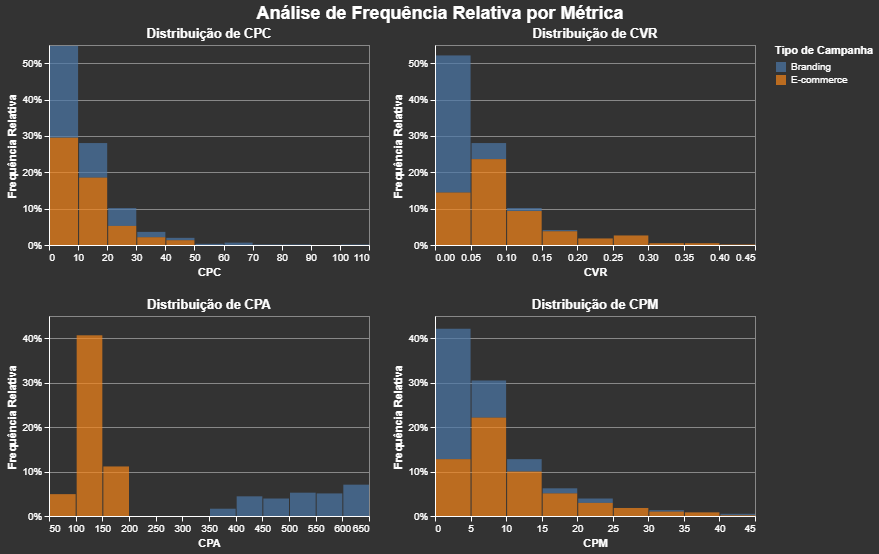

------------------------------------------------------------------------

# **EDA - Campanhas de Marketing Nubank (Meta Ads)**

Análise Exploratória de Dados das campanhas de Marketing do Nubank na Meta (Facebook/Instagram Ads).

Abrir no 

------------------------------------------------------------------------

## **Descrição do Problema**

O Nubank realiza um grande volume de campanhas de aquisição na Meta, divididas principalmente entre **Branding** e **D&R (Direct & Response / E-commerce)**.

Apesar do alto investimento, observou-se uma **performance heterogênea** entre as campanhas, com variações significativas no **CPA (Custo por Aquisição)**.

O objetivo desta análise foi investigar os principais fatores que influenciam o desempenho das campanhas, validar hipóteses de negócio e gerar insights acionáveis para otimização de futuras estratégias de mídia paga.

**Principais questões investigadas:** - Diferença de performance entre campanhas de Branding e D&R - Impacto do modelo de atribuição (1-day view / 7-day click) - Influência dos atributos do Ad Set e do Ad - Possível sinergia ou conflito entre criativos e segmentações

------------------------------------------------------------------------

## **Pacotes Utilizados**

- **pandas** – Manipulação e análise de dados
- **numpy** – Operações numéricas
- **matplotlib** + **seaborn** – Visualizações estáticas
- **plotly** – Visualizações interativas
- **marimo** – Ambiente do notebook
- **scipy** / **statsmodels** – Testes estatísticos e regressão
- **scikit-learn** – (pré-processamento e modelagem exploratória)

------------------------------------------------------------------------

## **Principais Insights do Projeto**

### 1. **Tipo de Campanha é o Fator Mais Relevante**

- Campanhas de **D&R (E-commerce)** apresentam **CPA significativamente menor** (\~R\$ 200 mais baratas) que campanhas de Branding.
- D&R também se destacam em métricas de eficiência (ROAS, CTR, frequência otimizada).

### 2. **Modelo de Atribuição**

- Não foi identificada **atribuição incorreta** significativa.
- A performance das campanhas não é afetada de forma relevante pelo modelo de atribuição utilizado (1-day view 7-day click).

### 3. **Atributos do Ad Set e do Ad**

- Os atributos individuais do Ad Set e do Ad têm **impacto limitado** no CPA.
- Não foi encontrada **sinergia ou conflito forte** entre as características do Ad Set e do Ad (termo de interação ≈ 0).

### 4. **Tendências Temporais**

- Não há diferença estatisticamente significativa de performance entre dias da semana.

------------------------------------------------------------------------

## **Resultados Finais e Recomendações**

### **Principais Conclusões**

| Fator | Impacto no CPA | Recomendação |
|---------------------------|---------------------------|------------------|
| Tipo de Campanha (D&R) | **Muito Alto** (-R\$ 200) | Priorizar orçamento em D&R |
| Atributos do Ad Set | Baixo (\~ -R\$ 3) | Otimizar, mas não é prioridade |
| Atributos do Ad | Moderado (\~ -R\$ 8) | Foco em criativos de alta performance |
| Modelo de Atribuição | Insignificante | Manter atual |
| Dia da Semana | Insignificante | Não direcionar estratégia por dia |

### **Recomendações Estratégicas**

1.  **Realocar orçamento** prioritariamente para campanhas de **D&R**.
2.  **Manter foco** na qualidade dos criativos (Ads), pois ainda apresentam maior impacto que a segmentação sozinha.
3.  **Testar criativos** de forma mais agressiva dentro das campanhas de D&R.
4.  **Reduzir complexidade** de segmentações excessivamente granulares no Ad Set, já que o ganho marginal é baixo.
5.  Usar os insights como base para construção de um **modelo preditivo de CPA** (próxima etapa sugerida).

------------------------------------------------------------------------

**Projeto desenvolvido como parte da análise exploratória para otimização de performance de mídia paga do Nubank.**

------------------------------------------------------------------------